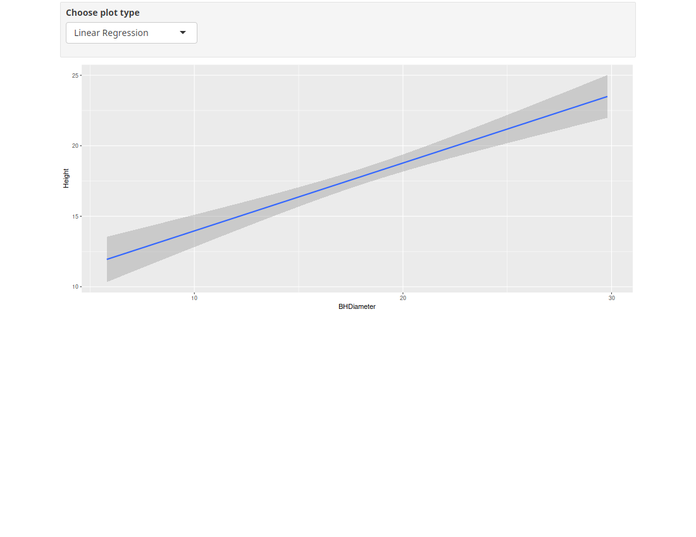
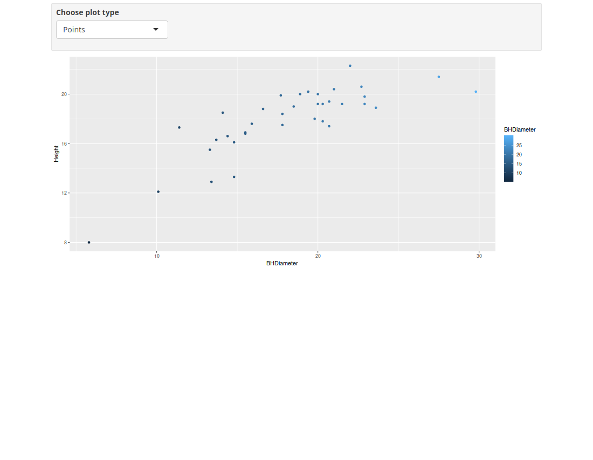
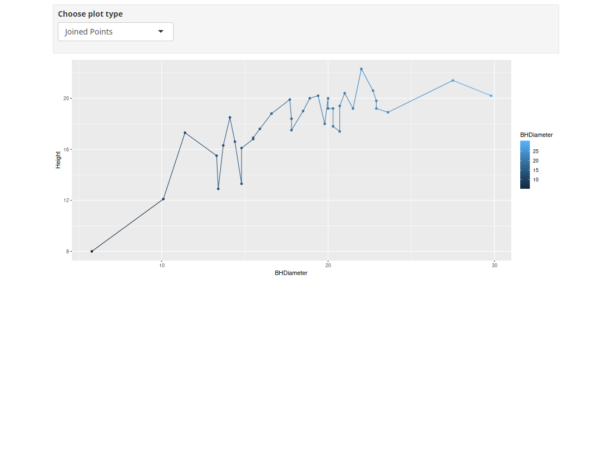

```{r setup, include=FALSE}
knitr::opts_chunk$set(echo = TRUE)
```
# Task 1
```{r}
getwd()
```


# Task 2
```{r}
spruce = read.csv("SPRUCE.csv")
head(spruce)
```

# Task 3
```{r}
plot(data = spruce, Height~BHDiameter, pch = 21, bg = "Blue", cex = 1.2, 
     ylim = c(0, 1.1*max(Height)), xlim = c(0, 1.1*max(BHDiameter)))
```
* There does not appear to be a perfectly straight line relationship, however it could be relatively close
```{r}
library(s20x)
layout(matrix(1:3, nr = 3))
trendscatter(Height~BHDiameter, f = 0.5, data = spruce)
trendscatter(Height~BHDiameter, f = 0.6, data = spruce)
trendscatter(Height~BHDiameter, f = 0.7, data = spruce)
```
```{r}
spruce.lm = lm(Height~BHDiameter, data = spruce)
plot(data = spruce, Height~BHDiameter, pch = 21, bg = "Blue", cex = 1.2, 
     ylim = c(0, 1.1*max(Height)), xlim = c(0, 1.1*max(BHDiameter)))
abline(spruce.lm)
```
* No, a straight line in this case is not appropriate, the curved lines given from the trendscatter plots provide a better fit.

# Task 4
```{r}
layout(matrix(1:4, nr = 2, nc = 2, byrow = TRUE))
layout.show(4)
# Plot scatter and fitted line
plot(data = spruce, Height~BHDiameter, pch = 21, bg = "Blue", cex = 1.2, 
     ylim = c(0, 1.1*max(Height)), xlim = c(0, 1.1*max(BHDiameter)))
abline(spruce.lm)

yhat = with(spruce, predict(spruce.lm, data.frame(BHDiameter)))
plot(data = spruce, Height~BHDiameter, pch = 21, bg = "Blue", cex = 1.2, 
     ylim = c(0, 1.1*max(Height)), xlim = c(0, 1.1*max(BHDiameter)))
with(spruce, segments(BHDiameter, Height, BHDiameter, yhat))
abline(spruce.lm)

plot(data = spruce, Height~BHDiameter, pch = 21, bg = "Blue", cex = 1.2, 
     ylim = c(0, 1.1*max(Height)), xlim = c(0, 1.1*max(BHDiameter)))
with(spruce, abline(h = mean(Height)))
abline(spruce.lm)
with(spruce, segments(BHDiameter, mean(Height), BHDiameter, yhat, col = "Red"))

plot(data = spruce, Height~BHDiameter, pch = 21, bg = "Blue", cex = 1.2, 
     ylim = c(0, 1.1*max(Height)), xlim = c(0, 1.1*max(BHDiameter)))
with(spruce, abline(h = mean(Height)))
with(spruce, segments(BHDiameter, Height, BHDiameter, mean(Height), col = "Green"))
```
```{r}
TSS = with(spruce, sum((Height - mean(Height))^2))
TSS
MSS = with(spruce, sum((yhat - mean(Height))^2))
MSS
RSS = with(spruce, sum((Height - yhat)^2))
RSS

MSS/TSS
```
* MSS/TSS is R^2^, or how close the data is to matching the regression line. Our R^2^ shows that while there is a decently good correlation between BHDiameter and Height.

```{r}
MSS + RSS
TSS
```
* MSS + RSS does in fact equal TSS

# Task 5
```{r}
summary(spruce.lm)
coef(spruce.lm)
```
* The value of slope: 0.4814743
* The value of the intercept: 9.1468390
* The equation for the fitted line: Height = 9.1468390 + 0.4814743*BHDiameter
```{r}
predict(spruce.lm, data.frame(BHDiameter = c(15, 18, 20)))
```
* Value corresponding to 15 is column 1
* Value corresponding to 18 is column 2
* Value corresponding to 20 is column 3

# Task 6
```{r}
library(ggplot2)
g = ggplot(spruce, aes(x = BHDiameter, y = Height, colour = BHDiameter)) 
g = g + geom_point() + geom_line() + geom_smooth(method = "lm")
g + ggtitle("Height vs BHDiameter")
```

# Task 7
<center>
{ width=70% }
</center>

<center>
{ width=70% }
</center>

<center>
{ width=70% }
</center>